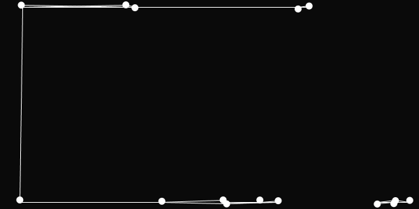

A project made in Processing 3. Moving dots bounce of the edges of the window and draw lines to their *n* nearest neighbours based on Euclidean distance. See .pde for the implementation and the .gif for a demonstration.

